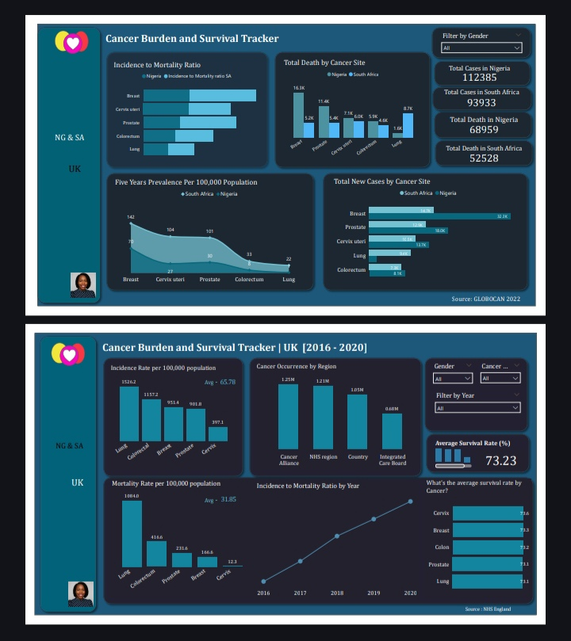

 ## Project Overview
This project analyses cancer data across the United Kingdom, Nigeria, and South Africa to understand how health system infrastructure, screening access, and resource availability shape cancer outcomes at a population level.
Most cancer analytics projects work within a single country. This project deliberately crosses borders — because the most revealing insights about why outcomes differ emerge when you compare countries where the disease biology is the same but the systems responding to it are not.

### Countries: 
United Kingdom · Nigeria · South Africa

### Cancer Types: 
Multiple (including breast, cervical, prostate, colorectal, lung)

### Metrics Analysed
- Incidence rates
- Mortality rates 
- Survival rates

## Tools & Skills
**Power BI** — Dashboard development and interactive visualisation

**Data Cleaning & Normalisation** — Cross-source harmonisation across three national datasets

**Age Standardisation** — World Standard Population methodology

**Healthcare Domain Knowledge** — Nuclear medicine · Nuclear physics graduate

## Key Questions This Project Answers
1. How do cancer incidence and mortality rates compare across the UK, Nigeria, and South Africa — three countries with fundamentally different health system models?

2. With the UK averaging a 73.23% survival rate against significantly lower figures in Nigeria and South Africa, how much of that gap is treatment quality versus stage at detection?

3. What does the data reveal about screening access and equity — from the UK's NHS cervical screening programme to near-absent early detection infrastructure in parts of sub-Saharan Africa?

4. How does South Africa's split public/private system produce outcomes that simultaneously resemble Western Europe and the broader sub-Saharan average within the same national dataset?

## Dashboard

## The dashboard includes:
**Incidence Rate Comparison** : Age-standardised rates per 100,000 population across all three countries, filterable by cancer type

**Mortality Rate Trends** : Year-on-year mortality trends with cross-country overlay

**Survival Rate Analysis** : 5-year survival rates by cancer type

**Country Profile Cards** : At-a-glance health system context for each country

## Data Sources
**Country**            |          **Source**

United Kingdom.        |        NHS Digital (2016 - 2020)                  

Nigeria & South Africa |        GLOBOCAN (2022)

## Methodology
#### Standardisation
Raw incidence and mortality counts were converted to age-standardised rates per 100,000 population using the World Standard Population. This allows meaningful comparison between countries with different population sizes and age structures.
#### Cross-Source Harmonisation
Each country's data comes from different registries with different collection periods, diagnostic classifications, and reporting standards. A normalisation process was applied to align definitions before any cross-country comparison was made.
#### Handling Missing Data
Missing data — particularly in the Nigerian dataset — was handled conservatively. Rather than imputing values, gaps are flagged in the dashboard and noted in interpretation. This decision reflects a core principle of this project: it is better to acknowledge uncertainty than to manufacture false precision.

This approach draws directly on training in nuclear medicine, where uncertainty quantification is standard practice. A scan result is never reported without understanding the margin of error. The same discipline applies here.

## Key Findings
1. The survival gap is a detection gap
Outcome differences between the UK and Nigeria are driven primarily by stage at diagnosis, not treatment quality. Most Nigerian cases are detected at stage III or IV — when survival rates are poor regardless of care received.
2. South Africa contains two datasets in one
Private sector outcomes broadly match Western European benchmarks. Public sector outcomes align with sub-Saharan African averages. This within-country divergence may be the dataset's most important signal.
3. Cervical cancer is the clearest equity story
Mortality differences across the three countries reflect gaps in HPV vaccination, screening access, and follow-up infrastructure — not cancer biology. A largely preventable disease remains a leading killer where prevention infrastructure is weakest.
4. The UK has its own disparities
Aggregate survival statistics look strong, but early detection uptake is significantly lower among Black African and Black Caribbean communities. National averages obscure meaningful within-population gaps.

## Limitations
**Underreporting**: Low incidence figures in Nigeria likely reflect incomplete registries, not low actual burden.

**Lead-time bias**: Earlier detection improves apparent survival time without necessarily extending life — cross-country survival comparisons must account for this.

**Misaligned time periods**: Data collection windows vary across countries; comparisons use the closest overlapping periods available.

**Missing context**: The data captures neither patient experience nor access barriers — travel distance, out-of-pocket costs, and reasons for late presentation — which are often the root causes behind the numbers.

**In Conclusion** This project was built because the questions it asks matter — not just analytically, but humanly.

Built as part of a personal portfolio in healthcare analytics. All data sourced from publicly available national registries and research organisations.
